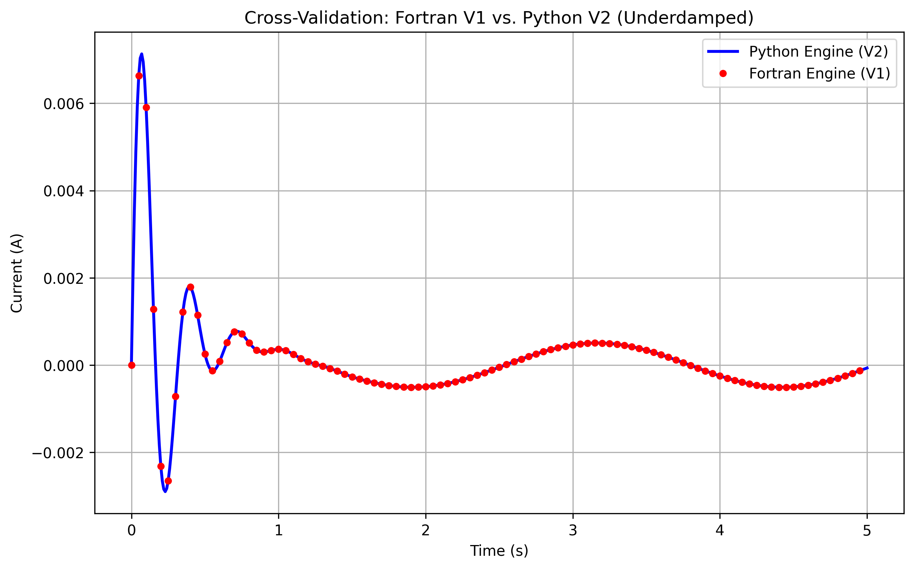
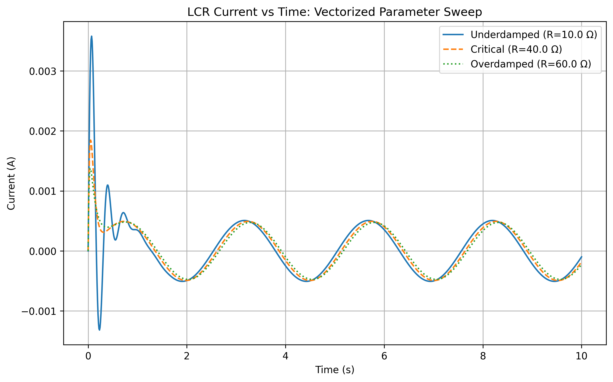

# LCR-Circuit-Modernization

## Overview

This repository documents the evolution of a computational physics study on Driven LCR-Series Circuits. Originally developed as a dissertation in June 2023 using procedural Fortran 90, this project is currently being modernized into a high-performance Python/NumPy framework.

The primary goal is to solve the governing second-order differential equation for an AC-driven LCR circuit using the 4th-Order Runge-Kutta (RK4) numerical method and to benchmark the performance gains of modern vectorization.

## Technical Background

The dynamic behavior of the circuit is modeled by Kirchhoff’s Voltage Law (KVL):

$$L\frac{d^2q}{dt^2} + R\frac{dq}{dt} + \frac{1}{C}q = V_0\sin(\omega t)$$

In this project, the 2nd-order ODE is decomposed into a system of two coupled 1st-order equations to allow for high-precision integration via the RK4 algorithm.

 $\frac{dq}{dt} = i$

 $\frac{di}{dt} = \frac{1}{L} \left( V_0\sin(\omega t) - Ri - \frac{q}{C} \right)$

This method captures transient responses and steady-state resonance with a validated accuracy of $10^{-6}$.

## Methodology

This project utilizes the 4th-Order Runge-Kutta (RK4) algorithm, which provides a local truncation error of $O(h^5)$ and a global error of $O(h^4)$. This allows for high-precision modeling of complex damping states:

- Underdamped: Characterized by oscillating transients before reaching steady-state resonance.

- Overdamped: A non-oscillatory return to equilibrium.

- Critically Damped: The fastest return to steady state without oscillation.

## Validation & Verification (V2 Python Engine)

A critical part of this modernization is proving the mathematical exactness of the new Python architecture.

### 1. SciPy Ground-Truth Validation

The custom Python RK4 engine (`lcr_engine.py`) was benchmarked against the industry-standard `scipy.integrate.solve_ivp` (RK45).

- Result: The maximum residual error across the entire time domain is $9.97 \times 10^{-8}$, proving the custom integrator is mathematically sound and research-grade.

### 2. Legacy Cross-Validation

The outputs of the V2 Python engine were overlaid with the raw data (`.dat`) from the original V1 Fortran dissertation to ensure physical continuity between the two frameworks.

**Validation Note on Superposition**: During the V1 to V2 migration, initial cross-validation revealed a transient phase shift. This was successfully traced back to the legacy Fortran architecture, which decoupled the Natural and Forced responses. To achieve the 100% trace overlay seen above, the Python V2 engine's initial boundary conditions were adjusted to mathematically reflect the superposition of the legacy states ($di/dt_{initial} = 0.2$ A/s).

## Vectorized Parameter Sweeping

By leveraging NumPy arrays, the V2 engine processes the Underdamped ($10 \Omega$), Critically Damped ($40 \Omega$), and Overdamped ($60 \Omega$) states simultaneously, eliminating the need for iterative loops.

## Performance Auditing (Fortran vs. Python)

A core objective of this project was measuring the computational overhead of migrating from a compiled language (Fortran) to an interpreted language (Python).

A stress-test benchmark was conducted evaluating the Underdamped LCR state over $N = 1,000,000$ integration steps on the same hardware.

| Engine | Language | N-Steps | Execution Time (s) | Relative Speed |
| :--- | :--- | :--- | :--- | :--- |
| **V1 Legacy Engine** | Fortran 90 | $10^6$ | 0.29 s | **1.0x (Baseline)** |
| **V2 Vectorized Engine** | Python 3 | $10^6$ | 78.77 s | ~269x slower |

**Conclusion:** Differential equation solvers (like RK4) are inherently sequential, meaning step $i+1$ strictly depends on step $i$. This prevents time-domain vectorization. Consequently, Python is forced to execute 1,000,000 interpreted `for` loops. The overhead of the Python interpreter results in the engine running roughly 269x slower than the pre-compiled Fortran executable.

*Future Optimization:* To bridge this gap in Python, Just-In-Time (JIT) compilers like `Numba` or `Cython` are required to bypass the interpreter loop overhead.

## Repository Structure

`v1_legacy_fortran/`
Contains the original research artifacts from the 2023 dissertation:

- Source Code: Procedural Fortran 90 implementations of the RK4 solver.

- Visualization: GnuPlot scripts used for transient and steady-state analysis.

- Documentation: The original unpublished dissertation PDF.

`v2_modern_python/` (Current Milestone)
A modular, high-performance refactor containing:

- `lcr_engine.py`: The core vectorized RK4 mathematical solver.

- `scipy_validation.py`: Residual calculation script vs. SciPy.

- `run_sweep.py`: Multi-parameter simultaneous solver script.

- `compare_legacy.py`: Cross-validation auditor against Fortran data.

### Upcoming Modernization Goals

- [x] Numerical Validation: Cross-verifying custom RK4 results against SciPy.

- [x] Vectorized Solvers: Re-implementing the RK4 engine using NumPy for multi-parameter sweeps.

- [x] Performance Auditing: Measuring the runtime overhead of Python vs. Fortran for large-scale simulations ($N > 10^6$ steps).

- [ ] Phase Space Analysis: Visualizing energy dissipation ($q$ vs. $i$) and attractor stability in complex damping scenarios.

## How to Use

1. Legacy: View original Fortran logic and GnuPlot visualizations in the `v1_legacy_fortran/` directory.

2. Modern: Run the Python engine (requires NumPy and Matplotlib) found in `v2_modern_python/`.
